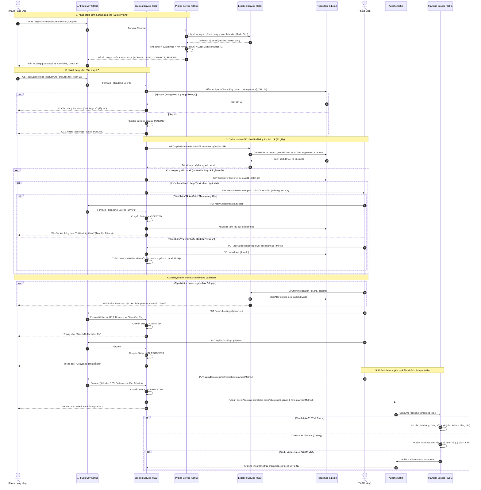
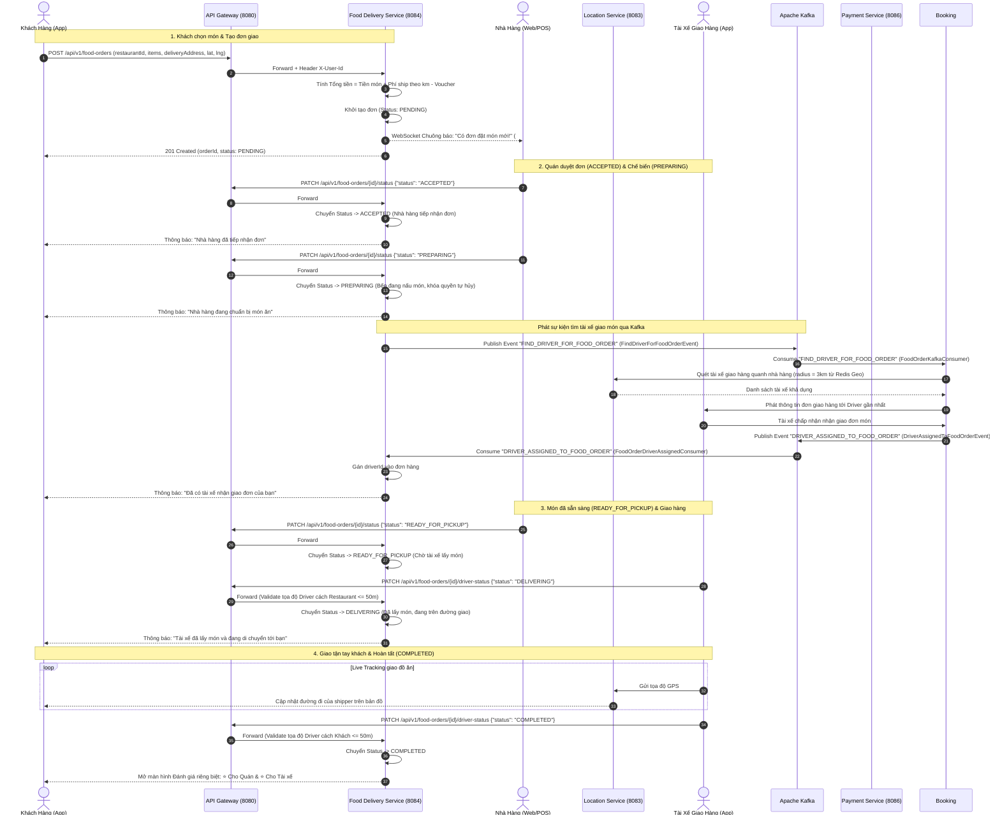
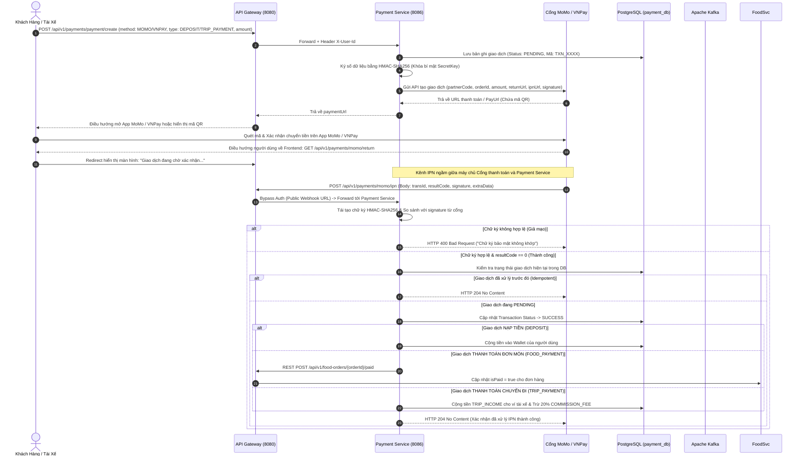
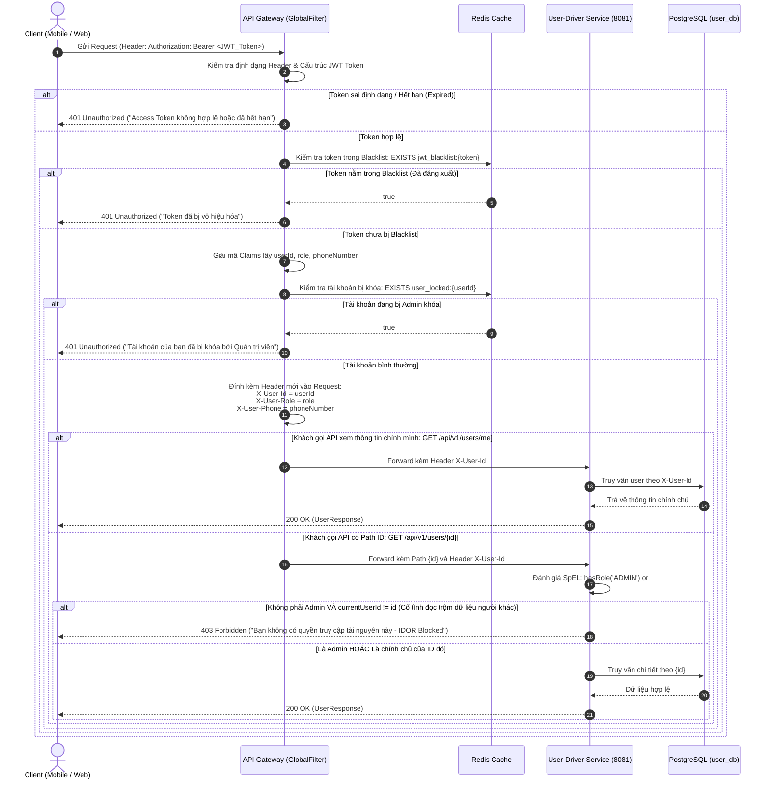

# TÀI LIỆU ĐẶC TẢ LUỒNG NGHIỆP VỤ & SƠ ĐỒ TUẦN TỰ HỆ THỐNG OMNIGO
*(OmniGo Business Flow Specification & Exact Implementation State Diagrams)*

---

## 1. TỔNG QUAN KIẾN TRÚC & CÁC TÁC NHÂN HỆ THỐNG (ACTORS & MICROSERVICES)

Hệ thống **OmniGo** vận hành trên nền tảng kiến trúc Microservices phân tán hướng sự kiện (Event-Driven Architecture), kết nối 4 nhóm tác nhân người dùng với 7 microservices chuyên biệt:

### 1.1. Các Tác Nhân Người Dùng (Actors)
| Tác nhân (Actor) | Nền tảng giao diện | Quyền hạn & Vai trò nghiệp vụ |
| :--- | :--- | :--- |
| **Khách Hàng (Customer)** | Android Mobile App | Tìm kiếm chuyến xe, chọn quán ăn, đặt đồ ăn, thanh toán không tiền mặt, theo dõi vị trí trực tiếp (Live Tracking) và đánh giá dịch vụ. |
| **Tài Xế (Driver)** | Android Mobile App | Bật/tắt trạng thái nhận cuốc (`ONLINE`/`OFFLINE`), phát tọa độ GPS liên tục, tiếp nhận cuốc xe trong 20 giây, đón trả khách hoặc đến quán lấy món đi giao. |
| **Nhà Hàng (Merchant)** | Web / Tablet Portal | Quản lý thực đơn, giờ mở cửa, nhận thông báo đơn hàng mới qua WebSocket, xác nhận chế biến và bàn giao món cho tài xế. |
| **Quản Trị Viên (Admin)** | React Web Dashboard | Thẩm định hồ sơ tài xế (`PENDING_APPROVAL` $\rightarrow$ `APPROVED`), khóa tài khoản vi phạm, cấu hình bảng giá/hệ số Surge và theo dõi thống kê toàn sàn. |

### 1.2. Các Dịch Vụ Thành Phần & Hạ Tầng Phân Tán (Microservices & Middleware)
* **API Gateway (Spring Cloud Gateway - Port 8080):** Cửa ngõ duy nhất lọc xác thực JWT, kiểm tra Blacklist/Khóa tài khoản qua Redis, đính kèm header `X-User-Id`, `X-User-Role`, `X-User-Phone` xuống các service nội bộ.
* **Discovery Service (Netflix Eureka - Port 8761):** Quản lý vòng đời và định danh tự động các instance microservices.
* **User & Driver Service (Port 8081):** Quản lý định danh, hồ sơ khách hàng, thông tin xe và trạng thái phê duyệt của tài xế (`PENDING_APPROVAL`, `APPROVED`, `REJECTED`).
* **Booking Service (Port 8082):** Quản lý toàn bộ vòng đời cuốc xe (Ride Lifecycle), thuật toán điều phối và luân chuyển tài xế (Auto-reassignment) theo `BookingStatus`.
* **Location Service (Port 8083):** Tiếp nhận GPS thời gian thực qua WebSocket/STOMP, lập chỉ mục không gian bằng **Redis Geospatial** (`GEOADD`, `GEOSEARCH`).
* **Food Delivery Service (Port 8084):** Quản lý danh mục nhà hàng, thực đơn món ăn, xử lý đơn đặt món 3 bên (Khách - Quán - Tài xế) theo `OrderStatus`.
* **Pricing Service (Port 8085):** Tính toán giá cước động (Surge Pricing) dựa trên khoảng cách, thời gian và mật độ cung-cầu phân vùng theo ô lục giác **Uber H3 Grid**.
* **Payment Service (Port 8086):** Xử lý ví điện tử, đối soát nạp/rút tiền, kết nối cổng thanh toán MoMo, VNPay qua Webhook IPN và trích thu hoa hồng tự động.
* **Apache Kafka:** Xương sống truyền thông điệp bất đồng bộ (Event-Driven Backbone), đảm bảo tính phân tách và chịu tải cao cho toàn bộ hệ thống.
* **Redis:** Bộ nhớ đệm phân tán, lưu trữ Blacklist JWT, Distributed Lock giữ chỗ tài xế (20s) và khóa chống spam đặt cuốc (5s).

---

## 2. CÁC SƠ ĐỒ TUẦN TỰ CHI TIẾT NHẤT (SEQUENCE DIAGRAMS)

---

### 2.1. Sơ Đồ Tuần Tự 1: Vòng Đời Đặt Xe & Điều Phối Chuyến Đi (OmniRide Lifecycle)
> **Trạng thái thực tế trong mã nguồn (`BookingStatus`):** `PENDING` $\rightarrow$ `ACCEPTED` $\rightarrow$ `ARRIVED` $\rightarrow$ `IN_PROGRESS` $\rightarrow$ `COMPLETED` (hoặc `CANCELLED`).

---

### 2.2. Sơ Đồ Tuần Tự 2: Vòng Đời Đặt Món 3 Bên (OmniFood Marketplace Lifecycle)
> **Trạng thái thực tế trong mã nguồn (`OrderStatus`):** `PENDING` $\rightarrow$ `ACCEPTED` $\rightarrow$ `PREPARING` $\rightarrow$ `READY_FOR_PICKUP` $\rightarrow$ `DELIVERING` $\rightarrow$ `COMPLETED` (hoặc `CANCELLED`, `REJECTED`, `NO_DRIVER_FOUND`).

---

### 2.3. Sơ Đồ Tuần Tự 3: Nạp Tiền & Thanh Toán Trực Tuyến Qua Cổng MoMo / VNPay (IPN Webhook)
> **Trạng thái thực tế trong mã nguồn (`TransactionStatus`):** `PENDING` $\rightarrow$ `SUCCESS` (hoặc `FAILED`, `CANCELLED`).

---

### 2.4. Sơ Đồ Tuần Tự 4: Kiểm Soát Xác Thực, Phân Quyền & Ngăn Chặn Lỗ Hổng IDOR

---

## 3. BẢNG MÁY TRẠNG THÁI CHUẨN XÁC THEO CODEBASE (STATE MACHINES)

### 3.1. Máy Trạng Thái Cuốc Xe (`BookingStatus`)
Khớp chính xác với enum `com.trung.bookingservice.util.enums.BookingStatus`:

| Trạng thái (`BookingStatus`) | Ý nghĩa | Điều kiện kích hoạt & Mô tả hành vi hệ thống |
| :--- | :--- | :--- |
| **`PENDING`** | Chờ tài xế nhận cuốc | Khách hàng bấm "Đặt chuyến". Cuốc xe được tạo trong DB, hệ thống quét toạ độ Redis Geo và phát thông báo đếm ngược 20 giây tới các tài xế khả dụng gần nhất. |
| **`ACCEPTED`** | Tài xế đã nhận cuốc | Tài xế bấm nhận chuyến trong thời gian đếm ngược 20s (giữ bằng Redis Lock). Bắn WebSocket thông tin tài xế cho khách hàng, mở kênh Live Tracking. |
| **`ARRIVED`** | Đã đến điểm đón | Tài xế di chuyển đến điểm đón của khách. Bắt buộc kiểm tra Geofencing: $\text{Distance}(\text{Driver}, \text{Pickup}) \le 50\text{m}$. Hệ thống gửi thông báo khách ra xe. |
| **`IN_PROGRESS`** | Đang chở khách | Khách đã lên xe, tài xế bấm bắt đầu hành trình. Hệ thống tính toán thời gian di chuyển thực tế. |
| **`COMPLETED`** | Hoàn thành chuyến xe | Tài xế chở khách đến điểm trả (khoảng cách $\le 50\text{m}$) và bấm kết thúc. Xuất bản sự kiện Kafka `booking-completed-topic` để thanh toán và thu hoa hồng. |
| **`CANCELLED`** | Cuốc xe đã bị hủy | Chuyến đi bị hủy bởi Khách hàng (trước khi đón) hoặc Tài xế hủy chuyến, hoặc hệ thống hủy khi hết thời gian chờ mà không tìm được tài xế. |

---

### 3.2. Máy Trạng Thái Đơn Đồ Ăn (`OrderStatus`)
Khớp chính xác với enum `com.trung.fooddeliveryservice.util.enums.OrderStatus`:

| Trạng thái (`OrderStatus`) | Ý nghĩa | Điều kiện kích hoạt & Mô tả hành vi hệ thống |
| :--- | :--- | :--- |
| **`PENDING`** | Chờ nhà hàng tiếp nhận | Đơn đặt món được tạo thành công, hệ thống gửi chuông báo WebSocket tới màn hình quản lý đơn của Nhà Hàng. |
| **`ACCEPTED`** | Nhà hàng đã tiếp nhận | Chủ quán/Bếp bấm nút tiếp nhận đơn hàng trên ứng dụng/web quản lý của quán. |
| **`PREPARING`** | Đang nấu món | Nhà hàng bắt đầu chế biến món ăn. Tại trạng thái này, khách hàng **không thể tự ý hủy đơn miễn phí**. Hệ thống quét tìm tài xế giao hàng lân cận. |
| **`READY_FOR_PICKUP`** | Món đã nấu xong | Bếp nấu và đóng gói xong, bấm thông báo sẵn sàng để tài xế có thể nhận đồ ăn ngay khi đến quán. |
| **`DELIVERING`** | Đang giao hàng | Tài xế có mặt tại quán (GPS $\le 50\text{m}$), nhận túi thức ăn và bắt đầu di chuyển tới địa chỉ của khách hàng (Live Tracking). |
| **`COMPLETED`** | Giao hàng thành công | Tài xế giao đồ ăn tận tay khách (GPS $\le 50\text{m}$) và bấm hoàn thành đơn. Kích hoạt sự kiện Kafka quyết toán dòng tiền 3 bên (Quán - Tài xế - Sàn). |
| **`CANCELLED`** | Đơn hàng đã hủy | Khách hủy đơn khi quán chưa nấu, hoặc tài xế/quán hủy đơn do sự cố. |
| **`REJECTED`** | Nhà hàng từ chối | Nhà hàng bấm từ chối nhận đơn (do hết món, quá tải hoặc sắp đến giờ đóng cửa). Tự động hoàn tiền ví cho khách. |
| **`NO_DRIVER_FOUND`** | Không tìm thấy tài xế | Hệ thống quét trong bán kính tối đa mà không có tài xế nào nhận giao đơn. Hệ thống tự động hủy đơn và hoàn tiền $100\%$ cho khách hàng. |

---

### 3.3. Các Enum Trạng Thái Khác Được Sử Dụng Trong Hệ Thống

#### A. Trạng thái Hoạt động của Tài xế (`DriverStatus`)
*File: `com.trung.userdriverservice.util.enums.DriverStatus`*
* **`OFFLINE`**: Tài xế đang nghỉ ngơi, tắt ứng dụng hoặc ngắt kết nối (vị trí bị xóa khỏi Redis Geo).
* **`ONLINE`**: Tài xế đang trực tuyến, sẵn sàng nhận cuốc xe hoặc đơn giao đồ ăn.
* **`BUSY`**: Tài xế đang thực hiện cuốc xe chở khách (`IN_PROGRESS`) hoặc đang giao đồ ăn (`DELIVERING`), tạm thời không nhận thêm cuốc mới.

#### B. Trạng thái Phê duyệt Tài xế (`ApprovalStatus`)
*File: `com.trung.userdriverservice.util.enums.ApprovalStatus`*
* **`PENDING_APPROVAL`**: Hồ sơ tài xế mới đăng ký, đang chờ Admin kiểm tra giấy tờ xe, bằng lái. Chưa thể bật `ONLINE`.
* **`APPROVED`**: Hồ sơ đã được Admin phê duyệt, tài xế có thể kích hoạt nhận cuốc.
* **`REJECTED`**: Hồ sơ bị từ chối do giấy tờ không hợp lệ. Tài xế cần gửi lại hồ sơ qua API `/resubmit`.

#### C. Vai trò Người dùng (`Role`)
*File: `com.trung.userdriverservice.util.enums.Role`*
* **`CUSTOMER`**: Khách hàng sử dụng dịch vụ.
* **`DRIVER`**: Đối tác tài xế vận chuyển và giao hàng.
* **`RESTAURANT`**: Đối tác chủ quán ăn / nhà hàng.
* **`ADMIN`**: Quản trị viên vận hành hệ thống.

#### D. Trạng thái Giao dịch Tài chính (`TransactionStatus`)
*File: `com.trung.paymentservice.util.enums.TransactionStatus`*
* **`PENDING`**: Giao dịch đang chờ thanh toán hoặc đang chờ phản hồi IPN từ cổng MoMo/VNPay.
* **`SUCCESS`**: Giao dịch thanh toán/nạp tiền thành công, số dư ví đã được cập nhật.
* **`FAILED`**: Giao dịch thất bại do số dư không đủ hoặc lỗi ngân hàng.
* **`CANCELED`**: Giao dịch bị hủy bỏ (lưu ý: mã nguồn định nghĩa `CANCELED` với 1 chữ 'L').

#### E. Loại Giao dịch Ví (`TransactionType`)
*File: `com.trung.paymentservice.util.enums.TransactionType`*
* **`DEPOSIT`**: Nạp tiền vào ví qua cổng thanh toán trực tuyến.
* **`TRIP_PAYMENT`**: Khách hàng trừ tiền ví thanh toán cước chuyến xe.
* **`TRIP_INCOME`**: Tài xế nhận cộng tiền doanh thu chuyến xe vào ví.
* **`COMMISSION_FEE`**: Hệ thống tự động khấu trừ 20% phí hoa hồng sàn từ ví tài xế.
* **`WITHDRAWAL`**: Tài xế rút tiền từ ví doanh thu về tài khoản ngân hàng liên kết.
* **`FOOD_PAYMENT`**: Thanh toán tiền đơn hàng đồ ăn qua ví.
* **`FOOD_DELIVERY_INCOME`**: Tiền công giao hàng cộng vào ví của tài xế giao món.
* **`REFUND`**: Hoàn tiền về ví cho khách hàng khi đơn/cuốc bị hủy.

#### F. Phương thức Thanh toán (`PaymentMethod`)
*File: `com.trung.paymentservice.util.enums.PaymentMethod`*
* **`CASH`**: Thanh toán bằng tiền mặt khi hoàn tất.
* **`WALLET`**: Thanh toán trừ trực tiếp từ số dư ví điện tử OmniGo.
* **`MOMO`**: Thanh toán trực tuyến qua cổng ví điện tử MoMo.
* **`VNPAY`**: Thanh toán trực tuyến qua cổng VNPay.

---

## 4. QUY TẮC RÀNG BUỘC KỸ THUẬT & CHỐNG GIAN LẬN (INTEGRITY RULES)

### 4.1. Khóa Chặt Vị Trí Bằng GPS Geofencing ($\le 50\text{m}$)
* **Tại bước tài xế bấm đã đến điểm đón (`ARRIVED`):**
  $$\text{HaversineDistance}(\text{Driver\_GPS}, \text{Pickup\_GPS}) \le 50\text{ mét}$$
* **Tại bước hoàn thành chuyến đi / giao món (`COMPLETED`):**
  $$\text{HaversineDistance}(\text{Driver\_GPS}, \text{Dropoff\_GPS}) \le 50\text{ mét}$$
* Nếu tài xế đứng cách vị trí quy định $> 50\text{m}$ mà bấm xác nhận, Backend lập tức từ chối và trả về mã lỗi HTTP `400 Bad Request` (*"Bạn chưa có mặt tại điểm quy định, vui lòng di chuyển đến gần hơn"*).

### 4.2. Cơ Chế Chống Race Condition Bằng Redis Lock (20 giây)
* Khóa phân tán: `SET lock:driver:{driverId} {bookingId} NX EX 20`
* Đảm bảo tính nguyên tử (Atomic): Một tài xế chỉ nhận được tối đa 1 lời mời cuốc xe tại một thời điểm, triệt tiêu hoàn toàn lỗi tranh chấp cuốc (Race Condition).
* Hết thời gian 20s không phản hồi, key Redis tự động giải phóng (TTL Expired), hệ thống tự động gán tài xế vào danh sách loại trừ (Blacklist) của cuốc này và chuyển lời mời cho tài xế gần tiếp theo.

---

## 5. HỢP ĐỒNG SỰ KIỆN TRUYỀN THÔNG APACHE KAFKA (KAFKA EVENT CONTRACTS)

Toàn bộ hệ thống Backend microservices của OmniGo hiện tại triển khai **chính xác 4 Kafka Topics** (đã được rà soát trực tiếp từ các Annotation `@KafkaListener` và lệnh `KafkaTemplate.send()` trong mã nguồn Java):

| Tên Topic Kafka | Event Class / Payload | Dịch vụ Gửi (Producer) | Dịch vụ Nhận (Consumer) | Mục đích & Xử lý nghiệp vụ thực tế trong mã nguồn |
| :--- | :--- | :--- | :--- | :--- |
| **`driver-registered-topic`** | `DriverRegisteredEvent` `{"driverId": Long}` | `user-driver-service` `DriverServiceImpl.java` (Line 79) | `payment-service` `WalletServiceImpl.java` (Line 40) | Khi tài xế mới đăng ký thành công qua API `/api/v1/drivers/register`, event được bắn đi. `payment-service` lắng nghe và tự động gọi `getOrCreateWallet(driverId, UserType.DRIVER)` để khởi tạo ví tiền với số dư 0 VNĐ. |
| **`booking-completed-topic`** | `BookingCompletedEvent` `{"bookingId": Long, "driverId": Long, "customerId": Long, "amount": Double}` | `booking-service` `BookingServiceImpl.java` (Line 483) | `payment-service` `WalletServiceImpl.java` (Line 104) | Khi cuốc xe hoàn thành (`COMPLETED`), `booking-service` phát sự kiện. `payment-service` tự động tính và trích trừ **20% phí hoa hồng sàn** (`COMMISSION_FEE = amount * 0.20`) từ ví của tài xế. Có cơ chế kiểm tra idempotent chống trừ phí 2 lần. |
| **`FIND_DRIVER_FOR_FOOD_ORDER`** | `FindDriverForFoodOrderEvent` `{"orderId": Long, "customerId": Long, "restaurantId": Long, "restaurantName": String, "restaurantAddress": String, "restaurantLatitude": Double, "restaurantLongitude": Double, "dropOffAddress": String, "dropOffLatitude": Double, "dropOffLongitude": Double, "totalPrice": BigDecimal, "deliveryFee": BigDecimal, "paymentMethod": String, "isPaid": Boolean}` | `food-delivery-service` `FoodEventPublisher.java` (Line 23) | `booking-service` `FoodOrderKafkaConsumer.java` (Line 17) | Khi nhà hàng chuyển trạng thái đơn sang chế biến (`PREPARING`), phát sự kiện yêu cầu điều phối tài xế. `booking-service` nhận event, dùng Redis Geo quét các tài xế trực tuyến trong bán kính quanh nhà hàng để gửi lời mời giao hàng. |
| **`DRIVER_ASSIGNED_TO_FOOD_ORDER`** | `DriverAssignedToFoodOrderEvent` `{"orderId": Long, "driverId": Long, "assignedAt": LocalDateTime}` | `booking-service` `FoodDeliveryDispatchServiceImpl.java` (Line 208) | `food-delivery-service` `FoodOrderDriverAssignedConsumer.java` (Line 17) | Khi tài xế bấm nhận đơn giao đồ ăn hoặc hệ thống ghép cuốc thành công, `booking-service` gửi sự kiện này ngược lại cho `food-delivery-service` để cập nhật `driverId` vào bảng `food_orders` và thông báo cho khách hàng. |
