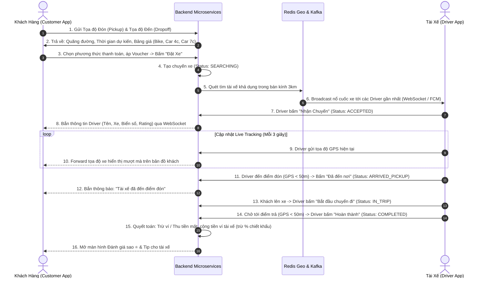
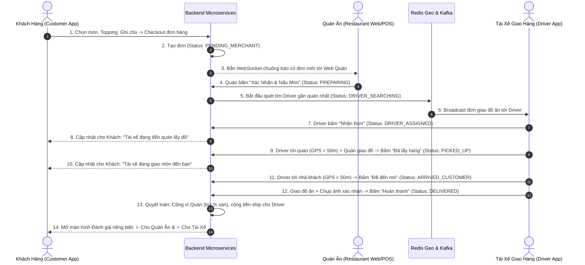

## 1. TỔNG QUAN CÁC TÁC NHÂN (ACTORS)

| Tác nhân | Nền tảng | Vai trò & Trách nhiệm |
| :--- | :--- | :--- |
| **Khách Hàng (Customer)** | Android Mobile App | Chọn dịch vụ, chọn điểm đến/quán ăn, thanh toán, theo dõi thời gian thực, đánh giá. |
| **Tài Xế (Driver)** | Android Mobile App | Bật/tắt nhận cuốc, nhận chuyến xe, lấy hàng tại quán, giao hàng/chở khách, cập nhật GPS. |
| **Nhà Hàng (Merchant)** | Web POS / Portal | Quản lý thực đơn, nhận đơn hàng, xác nhận chế biến, bàn giao món ăn cho tài xế. |
| **Quản Trị Viên (Admin)** | Web Admin Portal | Duyệt hồ sơ tài xế (`PENDING` $\rightarrow$ `APPROVED`), khóa/mở tài khoản, giám sát doanh thu. |
| **Hệ Thống (Backend)** | Spring Boot Microservices | Xử lý nghiệp vụ, điều phối Kafka, định vị Redis Geo, bắn WebSocket real-time, State Machine. |

---

## 2. ĐẶC TẢ LUỒNG ĐẶT XE (OMNIRIDE)

### 2.1. Sơ Đồ Tuần Tự (Sequence Diagram)



### 2.2. Bảng Trạng Thái Chuyến Xe (Ride State Machine)

| Trạng thái (Enum) | Ý nghĩa | Mô tả hành vi hệ thống & UI |
| :--- | :--- | :--- |
| `DRAFT` | Bản nháp | Khách đang chọn điểm đến, kiểm tra giá, áp voucher. |
| `SEARCHING` | Đang tìm xe | App hiện radar quét, Backend broadcast qua Kafka cho Driver gần nhất. Timeout 60s. |
| `ACCEPTED` | Tài xế đã nhận | Hiển thị thông tin xe, tài xế; mở kênh Chat/Gọi; Live GPS Tracking. |
| `ARRIVED_PICKUP`| Tài xế đã đến điểm đón | Chỉ cho phép bấm khi khoảng cách GPS $< 50\text{m}$. Khách nhận thông báo ra xe. |
| `IN_TRIP` | Đang di chuyển | Khách đã lên xe, tài xế chở khách theo lộ trình bản đồ. |
| `COMPLETED` | Hoàn thành | Quyết toán cước phí, gửi hóa đơn điện tử, mở form đánh giá 1-5 sao. |
| `CANCELLED` | Đã hủy | Chuyến đi bị hủy bởi Khách / Tài xế / Hệ thống Timeout. |

---

## 3. ĐẶC TẢ LUỒNG ĐẶT ĐỒ ĂN (OMNIFOOD)

### 3.1. Sơ Đồ Tuần Tự (Sequence Diagram - Mô Hình 3 Bên)



### 3.2. Bảng Trạng Thái Đơn Đồ Ăn (Food Order State Machine)

| Trạng thái (Enum) | Ý nghĩa | Mô tả hành vi hệ thống & UI |
| :--- | :--- | :--- |
| `PENDING_PAYMENT` | Chờ thanh toán | Khách thanh toán qua cổng VNPay/MoMo (nếu chọn trả trước). |
| `PENDING_MERCHANT`| Chờ quán nhận | Đơn gửi tới Web Quán. Quán có 3 phút để xác nhận hoặc từ chối hết món. |
| `PREPARING` | Quán đang nấu | Quán xác nhận làm món. Khách **không thể tự ý hủy đơn miễn phí**. |
| `DRIVER_SEARCHING`| Đang tìm tài xế | Hệ thống quét tìm tài xế quanh khu vực quán ăn. |
| `DRIVER_ASSIGNED` | Đã có tài xế | Tài xế đang di chuyển đến quán để lấy đồ. |
| `PICKED_UP` | Đã lấy món | Driver đã có mặt tại quán (GPS $<50\text{m}$), kiểm tra món và bấm nhận hàng. |
| `DELIVERING` | Đang giao hàng | Driver di chuyển từ quán tới địa chỉ khách hàng (Live Tracking). |
| `ARRIVED_CUSTOMER`| Đã đến nhà khách | Driver có mặt tại vị trí khách (GPS $<50\text{m}$), gọi khách ra nhận đồ. |
| `DELIVERED` | Đã giao thành công | Giao đồ thành công, thanh toán quyết toán, mở đánh giá 2 chiều. |
| `CANCELLED` | Đã hủy | Đơn bị hủy (Hết món / Không có tài xế / Lỗi thanh toán). |

---

## 4. CÁC QUY TẮC NGHIỆP VỤ & CHỐNG GIAN LẬN (INTEGRITY & ANTI-FRAUD)

### 4.1. Khóa Chặt Bằng GPS Geofencing (Khắc phục lỗi nhảy cóc trạng thái)
- **Nút "Đã lấy hàng" (PICKED_UP)**:
  - Client Mobile kiểm tra tọa độ: $\text{Distance}(\text{Driver\_GPS}, \text{Restaurant\_GPS}) \le 50\text{m}$.
  - Backend validation: Nếu Driver gọi API mà tọa độ $> 50\text{m} \rightarrow$ Trả về HTTP `400 Bad Request` (*"Bạn chưa có mặt tại quán"*).
- **Nút "Đã đến nơi" / "Hoàn thành" (ARRIVED / COMPLETED)**:
  - Bắt buộc $\text{Distance}(\text{Driver\_GPS}, \text{Destination\_GPS}) \le 50\text{m}$.

### 4.2. Quy Tắc Duyệt & Quản Trị Tài Xế (Admin Driver Moderation)
- Đăng ký mới: Trạng thái ban đầu là `PENDING`.
- Tài xế chưa được duyệt: **Không thể bật nút "Nhận chuyến"**, hiển thị màn hình *"Hồ sơ đang chờ duyệt"*.
- Quản trị viên (Admin Web): Xem hồ sơ, bằng lái, CCCD $\rightarrow$ Bấm `APPROVED`.
- Chức năng Khóa tài khoản: Admin có quyền đổi `ACTIVE` $\leftrightarrow$ `INACTIVE` để khóa tài xế vi phạm ngay lập tức.

### 4.3. Chính Sách Hủy Đơn & Hoàn Tiền (Cancellation & Refund Rules)

```
                                [KHÁCH BẤM HỦY ĐƠN]
                                         │
                 ┌───────────────────────┴───────────────────────┐
           [ĐẶT XE OMNIRIDE]                            [ĐẶT ĐỒ ĂN OMNIFOOD]
                 │                                               │
     ┌───────────┴───────────┐                       ┌───────────┴───────────┐
[Đang SEARCHING]     [Sau khi ACCEPTED > 2p]   [Quán chưa nhận]         [Quán đang PREPARING]
     │                       │                       │                       │
Hủy miễn phí 100%       Phạt phí hủy 10k        Hủy miễn phí 100%        Không cho tự hủy
(Hoàn 100% tiền ví)    (Bồi thường tài xế)     (Hoàn 100% tiền ví)     (Bắt buộc gọi CSKH)
```

### 4.4. Xử Lý Timeout Khi Không Tìm Thấy Tài Xế (Fallback Strategy)
- Sau 30 giây đầu: Mở rộng bán kính tìm kiếm từ $3\text{km} \rightarrow 5\text{km}$.
- Sau 60 giây không có Driver nhận:
  - Bắn thông báo hỏi khách: *"Hiện tại chưa tìm được tài xế gần bạn, bạn có muốn tiếp tục chờ không?"*.
  - Nếu khách chọn hủy: Hệ thống chuyển state `CANCELLED`, hoàn tiền ví $100\%$ ngay lập tức.

---

## 5. CÁC ENUM DỮ LIỆU DÙNG CHUNG (SHARED DATA CONTRACTS)

```kotlin
// 1. Trạng thái chuyến xe
enum class RideStatus {
    DRAFT, SEARCHING, ACCEPTED, ARRIVED_PICKUP, IN_TRIP, COMPLETED, CANCELLED
}

// 2. Trạng thái đơn đồ ăn
enum class FoodOrderStatus {
    PENDING_PAYMENT, PENDING_MERCHANT, PREPARING, DRIVER_SEARCHING, 
    DRIVER_ASSIGNED, PICKED_UP, DELIVERING, ARRIVED_CUSTOMER, DELIVERED, CANCELLED
}

// 3. Trạng thái tài khoản người dùng
enum class UserStatus {
    PENDING, APPROVED, ACTIVE, INACTIVE, REJECTED
}

// 4. Phương thức thanh toán
enum class PaymentMethod {
    CASH, WALLET, VNPAY, MOMO
}
```
