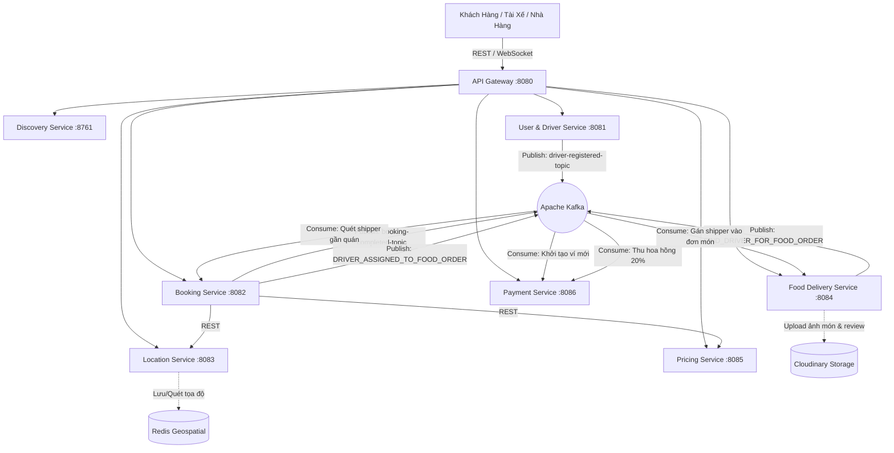

# OmniGo - Hệ Thống Siêu Ứng Dụng Đa Dịch Vụ (Ride-Hailing & Food Delivery Platform)

Hệ thống Siêu ứng dụng Đa dịch vụ **OmniGo** (Đặt xe công nghệ, Giao đồ ăn ẩm thực, Thanh toán ví điện tử) xây dựng theo kiến trúc **Microservices phân tán hướng sự kiện (Event-Driven Architecture)**.

---

## 1. Tổng quan Dự án

OmniGo cung cấp giải pháp toàn diện cho hệ sinh thái đa tác nhân: **Khách Hàng (Customer)**, **Đối Tác Tài Xế (Driver)**, **Đối Tác Nhà Hàng (Merchant)** và **Quản Trị Viên (Admin)**.

Hệ thống giải quyết trọn vẹn 2 mảng nghiệp vụ cốt lõi:
1. **OmniRide (Đặt xe chở khách):** Định giá động (Surge Pricing lưới H3), quét tìm tài xế gần nhất qua Redis Geo, giữ chỗ bằng Redis Lock (20s), Live Tracking GPS thời gian thực và quyết toán cước phí tự động.
2. **OmniFood (Giao đồ ăn ẩm thực):** Quản lý thực đơn & quán ăn, quy trình đặt món 3 bên (Khách - Quán - Shipper), tự động ghép shipper giao món qua Apache Kafka, đánh giá kép (Quán ăn & Tài xế) kèm tải ảnh món ăn lên Cloudinary, ràng buộc khóa tạo mới sau 1 tuần và khóa chỉnh sửa sau 48 giờ.

---

## 2. Kiến trúc Hệ thống Microservices

Hệ thống được chia tách thành các Domain độc lập theo nguyên lý **Database-per-Service** để đảm bảo khả năng mở rộng ngang, chịu tải cao và cô lập lỗi:

### 2.1. Danh sách Microservices & Cổng Port

| Microservice | Port | Database | Trách nhiệm & Nghiệp vụ chính |
| :--- | :---: | :---: | :--- |
| **API Gateway** | `8080` | Redis (Cache) | Cửa ngõ duy nhất, xác thực JWT Token, kiểm tra Blacklist Token / Tài khoản bị khóa, đính kèm headers `X-User-Id`, `X-User-Role`, `X-User-Phone` xuống các service nội bộ. |
| **Discovery Service** | `8761` | - | Netflix Eureka Server, đăng ký và phát hiện dịch vụ tự động (Service Registry & Discovery). |
| **User & Driver Service** | `8081` | `user_db` (Postgres) | Quản lý định danh người dùng, hồ sơ khách hàng, thông tin phương tiện và trạng thái phê duyệt tài xế (`PENDING_APPROVAL`, `APPROVED`, `REJECTED`). |
| **Booking Service** | `8082` | `booking_db` (Postgres) | Xử lý toàn bộ vòng đời cuốc xe (Ride Lifecycle: `PENDING` $\rightarrow$ `ACCEPTED` $\rightarrow$ `ARRIVED` $\rightarrow$ `IN_PROGRESS` $\rightarrow$ `COMPLETED`), thuật toán luân chuyển tài xế tự động (Auto-reassignment) và trung phối shipper giao món ăn. |
| **Location Service** | `8083` | Redis (Geo) | Tiếp nhận luồng GPS thời gian thực qua WebSocket/STOMP, lưu trữ và truy vấn không gian bằng **Redis Geospatial** (`GEOADD`, `GEOSEARCH`). |
| **Food Delivery Service** | `8084` | `food_delivery_db` (Postgres) | Quản lý nhà hàng, danh mục thực đơn món ăn, xử lý đơn đặt món 3 bên theo `OrderStatus`, hệ thống Đánh giá & Phản hồi (`food-reviews`), tải ảnh Cloudinary (tối đa 5 ảnh, định dạng PNG/JPG/WEBP). |
| **Pricing Service** | `8085` | - | Tính giá cước động (Surge Pricing) theo khoảng cách, thời gian và mật độ cung-cầu phân vùng theo ô lục giác **Uber H3 Grid**. |
| **Payment Service** | `8086` | `payment_db` (Postgres) | Quản lý số dư ví điện tử OmniPay, tích hợp cổng thanh toán trực tuyến MoMo / VNPay (IPN Webhook), xử lý nạp/rút tiền và tự động trích thu 20% phí hoa hồng sàn. |

---

### 2.2. Sơ đồ Kiến trúc & Luồng Dữ liệu Tổng Thể



---

## 3. Các Luồng Nghiệp Vụ Trọng Tâm (Core Business Flows)

### 3.1. Đặt Xe & Điều Phối Chuyến Đi (OmniRide)
1. **Tính giá động (Surge Pricing):** Tính toán cước phí theo công thức: $\text{Fare} = (\text{BasePrice} + \text{Distance} \times \text{PricePerKm}) \times \text{SurgeMultiplier}$ dựa trên mật độ tài xế xung quanh từ Redis Geo và ô lục giác H3.
2. **Khóa chống spam & Giữ chỗ:** Chặn đặt cuốc liên tục trong vòng 5 giây (`spam:booking:{userId}`); dùng **Redis Lock** (`SET lock:driver:{driverId} NX EX 20`) giữ chỗ tài xế trong 20 giây. Hết 20s không nhận sẽ tự động chuyển tài xế kế tiếp.
3. **Live Tracking & Geofencing:** Cập nhật tọa độ di chuyển qua WebSocket STOMP; khóa chặt vị trí đón và trả khách bằng công thức khoảng cách Haversine: $\text{Distance} \le 50\text{m}$.
4. **Quyết toán tự động:** Cuốc xe hoàn tất (`COMPLETED`), phát sự kiện Kafka `booking-completed-topic`, Payment Service tự động khấu trừ 20% phí hoa hồng sàn từ ví tài xế.

### 3.2. Chợ Ẩm Thực & Giao Đồ Ăn 3 Bên (OmniFood)
1. **Đặt món & Thanh toán:** Hỗ trợ Tiền mặt (COD) hoặc Thanh toán Online (Ví OmniPay, MoMo, VNPay).
2. **Bếp chuẩn bị & Ghép Shipper qua Kafka:** Khi quán chuyển trạng thái sang `PREPARING`, phát sự kiện `FIND_DRIVER_FOR_FOOD_ORDER`. Booking Service quét tài xế gần quán trong bán kính 3km. Khi shipper nhận đơn, phát sự kiện `DRIVER_ASSIGNED_TO_FOOD_ORDER` đồng bộ về Food Service. Hỗ trợ Quét lại (Retry) tối đa 3 lần nếu chưa tìm được shipper.
3. **Bàn giao món & Giao hàng:** Quán báo nấu xong (`READY_FOR_PICKUP`) $\rightarrow$ Shipper lấy món và giao hàng (`DELIVERING`) $\rightarrow$ Giao tận tay khách (`COMPLETED`).

### 3.3. Đánh Giá & Phản Hồi Đơn Hàng (Food Review System)
1. **Ràng buộc khóa tạo mới sau 1 tuần:** Đơn hàng hoàn thành quá 7 ngày sẽ bị khóa tạo mới (`400 Bad Request`).
2. **Ràng buộc khóa chỉnh sửa sau 48 giờ:** Khách chỉ được sửa đánh giá trong vòng 48 giờ kể từ lúc tạo (`createdAt + 48h`). Quá 48h tự động chuyển sang chế độ Chỉ xem (`readOnly: true`).
3. **Giới hạn ảnh tải lên (Cloudinary):** Tối đa **5 ảnh** cho mỗi đánh giá; chỉ chấp nhận định dạng ảnh `.png`, `.jpg`, `.jpeg`, `.webp`.
4. **Tự động đồng bộ điểm quán:** Tự động tính lại điểm sao trung bình (`rating`) và tổng số đánh giá (`reviewCount`) của nhà hàng ngay khi gửi.
5. **Chủ quán phản hồi & Admin giám sát:** Nhà hàng có thể gửi phản hồi (`merchantReply`) tới khách; Admin chỉ có quyền xem chi tiết, không được sửa.

### 3.4. Hệ Thống Sự Kiện Apache Kafka (Kafka Topics)

| Topic Name | Producer | Consumer | Xử lý nghiệp vụ |
| :--- | :--- | :--- | :--- |
| `driver-registered-topic` | `user-driver-service` | `payment-service` | Tự động khởi tạo ví tiền đối tác với số dư 0 VNĐ. |
| `booking-completed-topic` | `booking-service` | `payment-service` | Tự động trích thu 20% phí hoa hồng sàn từ ví tài xế (có cơ chế Idempotent chống trừ lặp). |
| `FIND_DRIVER_FOR_FOOD_ORDER` | `food-delivery-service` | `booking-service` | Yêu cầu quét tài xế giao hàng trực tuyến quanh nhà hàng trong bán kính 3km. |
| `DRIVER_ASSIGNED_TO_FOOD_ORDER` | `booking-service` | `food-delivery-service` | Cập nhật `driverId` vào đơn hàng khi có shipper tiếp nhận cuốc giao món. |

---

## 4. Công Nghệ & Hạ Tầng Sử Dụng

* **Backend Core:** Java 17, Spring Boot 3.x, Spring Cloud Gateway, Netflix Eureka
* **Cơ sở dữ liệu:** PostgreSQL (Database-per-service), Spring Data JPA, Hibernate, Flyway Migration
* **Bộ nhớ đệm & Khóa phân tán:** Redis (Redis Geo, Redis Lock, TTL Blacklist Token)
* **Message Broker:** Apache Kafka (Event-driven streaming)
* **Real-time Communication:** WebSocket, STOMP Protocol, SockJS
* **Không gian địa lý (Geo):** Uber H3 Grid Indexing, Haversine Geofencing ($\le 50\text{m}$)
* **Lưu trữ đám mây:** Cloudinary SDK (Upload hình ảnh nhà hàng, món ăn & đánh giá)
* **Cổng thanh toán:** MoMo Payment Gateway, VNPay (HMAC-SHA256 Signature, IPN Webhook)
* **Frontend Đa Nền Tảng:**
  * React Vite (Merchant Portal & Admin Dashboard tại thư mục `SRC/FE`)
  * HTML5/JavaScript (Demo App Khách hàng `customer-app.html` & Tài xế `driver-app.html`)
  * Android Native App (Customer App & Driver App)
* **Đóng gói & Vận hành:** Docker, Docker Compose, Nginx Reverse Proxy

---

## 5. Hướng Dẫn Chạy Cục Bộ (Local Development)

### 5.1. Yêu cầu Tiên quyết
* Java JDK 17+
* Node.js 18+ & npm
* Docker & Docker Compose (cho PostgreSQL, Redis, Kafka)

### 5.2. Khởi chạy Hạ tầng Middleware (Docker)
```bash
# Khởi động PostgreSQL, Redis, Apache Kafka, Zookeeper
docker-compose up -d
```

### 5.3. Khởi chạy các Microservices Backend (Theo Thứ Tự)
```bash
# 1. Discovery Service (Bắt buộc chạy trước)
cd SRC/BE/discovery-service && ./gradlew bootRun

# 2. API Gateway
cd SRC/BE/api-gateway && ./gradlew bootRun

# 3. Các Core Services (Có thể khởi chạy song song)
cd SRC/BE/user-driver-service && ./gradlew bootRun
cd SRC/BE/location-service && ./gradlew bootRun
cd SRC/BE/pricing-service && ./gradlew bootRun
cd SRC/BE/booking-service && ./gradlew bootRun
cd SRC/BE/food-delivery-service && ./gradlew bootRun
cd SRC/BE/payment-service && ./gradlew bootRun
```

### 5.4. Khởi chạy Giao diện Frontend (React Vite)
```bash
cd SRC/FE
npm install
npm run dev
# Truy cập Merchant / Admin Portal: http://localhost:5173
```

---

## 6. Kịch Bản Demo & Tài Khoản Mẫu

### 6.1. Môi trường Staging Demo
* **Máy chủ Staging:** `https://ridehailingsystem.online`
* **Demo Khách Hàng (Web):** `https://ridehailingsystem.online/customer-app.html`
  * Đăng nhập: SĐT `0923456987` | Mật khẩu: `123456`
* **Demo Tài Xế (Web):** `https://ridehailingsystem.online/driver-app.html`
  * Đăng nhập: SĐT `0867993172` | Mật khẩu: `123456`
* **Cổng Nhà Hàng & Admin (React):** `http://localhost:5173`
  * Đăng nhập Chủ quán: SĐT chủ quán đăng ký tại `/api/v1/restaurants/partner`
  * Đăng nhập Quản trị viên: Quyền `ROLE_ADMIN`

### 6.2. Kịch bản Thử nghiệm Nhanh
1. **Thử nghiệm Đặt xe (OmniRide):** Đăng nhập App Khách $\rightarrow$ Chọn điểm đến $\rightarrow$ Hệ thống tính giá Surge $\rightarrow$ Đặt xe $\rightarrow$ App Tài xế nhận cuốc (20s) $\rightarrow$ Đón khách (Geofencing 50m) $\rightarrow$ Hoàn thành $\rightarrow$ Trừ 20% hoa hồng vào ví tài xế.
2. **Thử nghiệm Đặt món & Đánh giá (OmniFood):** Đăng nhập App Khách $\rightarrow$ Khám phá quán ăn & Chọn món $\rightarrow$ Đặt món COD/Ví $\rightarrow$ Quán nhận đơn & Nấu món $\rightarrow$ Shipper nhận đơn giao món $\rightarrow$ Giao hoàn tất $\rightarrow$ Mở modal Đánh giá kép $\rightarrow$ Tải tối đa 5 ảnh (PNG/JPG/WEBP) $\rightarrow$ Gửi đánh giá $\rightarrow$ Điểm quán cập nhật ngay lập tức $\rightarrow$ Quán phản hồi đánh giá.